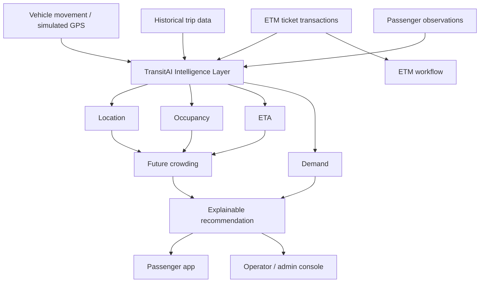
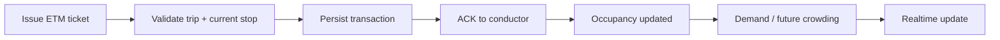
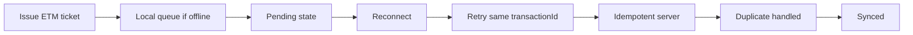

# TransitAI Mesh

TransitAI Mesh is a deployable, evaluation-backed transit intelligence prototype for passenger guidance, ETM operations, and operator monitoring. It is intentionally not a full production transit system: the project demonstrates real backend logic, database-backed ETM idempotency, live occupancy reasoning, and explainable recommendation behavior using simulated movement and an ETM-first operational model.

## 1. Product overview

The product addresses a common transit problem: riders and operators do not have a trustworthy, operationally grounded view of bus arrival, crowding, delay risk, and the best alternative options. The app combines:

- vehicle movement context from simulated GPS/location updates
- ETM transactions as the primary operational signal
- route structure and stop progression
- crowd reports as supplemental validation signals
- deterministic demand and ETA intelligence
- explainable recommendations for passengers and operators

This is a proof-oriented prototype for a real-world operating model, not a claiming of hardware integration.

## 2. Problem

Most transit experiences fail in exactly three ways:

1. passengers see stale or anecdotal occupancy information
2. operators cannot reason from a single authoritative source of truth
3. delayed vehicles are not translated into clear decisions for rider choice

TransitAI Mesh focuses on the first operational truth: ETM transactions represent actual passenger movement through a route. GPS increases context; crowd reports provide validation; the final intelligence layer estimates occupancy and future demand.

## 3. Core thesis

The primary operational signal is the conductor’s Electronic Ticket Machine, not the passenger phone and not the driver phone.

The design is intentionally simple and defensible:

- movement context is inferred from GPS or simulated bus progress
- ETM events define boarded passengers and route progression
- occupancy estimates and future crowding are derived from transaction data
- demand and recommendation logic explain the likely next conditions

This is the correct architecture for a serious operational demo, even though it remains a prototype.

## 4. Architecture



## 5. Signal layer

The signal layer decides what matters operationally:

- ETM ticket transactions are the primary source of passenger movement evidence
- route stop sequencing and bus progress define the current state
- GPS or simulated vehicle location provides movement context
- crowd reports remain supplemental and are not allowed to override ETM truth

This is a deliberate design decision grounded in operational reality.

## 6. Intelligence layer

The backend derives the following operational views from real ticket data and route state:

- current onboard occupancy
- segment usage over route progression
- future stop demand
- delay-implied ETA changes
- recommendation ranking for available options

The intelligence layer deliberately stays deterministic and explainable rather than claiming high-precision machine learning performance.

## 7. Recommendation layer

The recommendation engine ranks alternatives using:

- ETA timing
- crowd penalty
- delay cost
- available seats
- route suitability

The scoring model is intentionally transparent and deterministic:

```text
score = (ETA segments * 4) + crowd penalty + (delay * 2) - (available seats * 0.15)
```

Lower scores are better. This is useful for a prototype and honest for evaluation purposes.

## 8. ETM workflow



Operationally, the ETM flow is:

1. current stop known
2. destination chosen
3. passenger count entered
4. transaction issued
5. backend validates legality and capacity
6. transaction persisted with idempotent transaction ID
7. occupancy, demand, and realtime state are recomputed

## 9. Offline / idempotency architecture



Key design points:

- duplicate ETM submissions must not double-count occupancy
- the server enforces a unique transaction ID index
- retried requests reuse the same transactionId
- the client removes local queue entries only after the server confirms acceptance or duplicate handling

## 10. Realtime architecture

The app uses Socket.IO for state changes and refresh-driven updates. The client can reconnect without reloading the app, and the controller refreshes authoritative server state on reconnect.

This avoids stale UI state and reduces the risk of duplicate listeners from repeated connection setup.

## 11. Technology stack

| Layer | Stack |
|---|---|
| Frontend | React, Vite, Tailwind CSS, React Router, Socket.IO client |
| Backend | Node.js, Express, Socket.IO |
| Database | MongoDB + Mongoose |
| Auth | JWT + bcrypt |
| Demo environment | local MongoDB + seeded route and user data |
| Testing | Node.js built-in test runner |

## 12. Local setup

Requirements:

- Node.js 20+
- MongoDB running locally or a reachable MongoDB instance

```powershell
Copy-Item server/.env.example server/.env
Copy-Item client/.env.example client/.env
npm run install:all
npm run seed
npm run dev:server
# second terminal
npm run dev:client
```

## 13. Mapping

TransitAI Mesh uses MapLibre GL JS for interactive geographic visualization.

The prototype displays simulated vehicle telemetry and seeded transit routes on a real-world geographic map. The current map uses the public CARTO Positron basemap style for street context and geographic orientation while keeping the TransitAI data model and bus telemetry separate from the map provider.

Vehicle positions are simulated for the prototype; the architecture is designed to accept real GPS/telematics feeds. The app does not claim real fleet hardware or real-world transit telemetry integration.

Map provider/style configuration is environment-driven through `VITE_MAP_STYLE_URL` and stays separate from the route and ticketing logic. The default style is a public MapLibre-compatible basemap from CARTO that works without a key for local development.

### Required frontend environment variables

```env
VITE_API_URL=http://localhost:5000/api
VITE_SOCKET_URL=http://localhost:5000
VITE_MAP_STYLE_URL=https://basemaps.cartocdn.com/gl/positron-gl-style/style.json
```

If a different provider is used, set `VITE_MAP_STYLE_URL` to the chosen MapLibre style URL. Public browser keys are acceptable only when the provider requires them, and they must be restricted to the correct domain configuration.

### Map provider notes

- Map rendering library: MapLibre GL JS
- Base map: CARTO Positron (public demo-safe basemap)
- Attribution is preserved through the map provider's standard license terms
- The map remains interactive with zoom, pan, bus markers, and route overlays
- The route geometry and stop coordinates remain server-provided geographic data, while the bus markers inherit current state from the backend bus model and simulated location service

## 14. Environment variables

Server variables:

```env
PORT=5000
MONGODB_URI=mongodb://127.0.0.1:27017/transitai_mesh
JWT_SECRET=replace-with-a-long-random-secret
CLIENT_URL=http://localhost:5173
CORS_ALLOWED_ORIGINS=http://localhost:5173
GPS_SIMULATOR_ENABLED=true
NODE_ENV=development
```

Frontend variables:

```env
VITE_API_URL=http://localhost:5000/api
VITE_SOCKET_URL=http://localhost:5000
VITE_MAP_STYLE_URL=https://basemaps.cartocdn.com/gl/positron-gl-style/style.json
```

Important: do not place production secrets in the frontend. Only public URLs belong in Vite variables.

## 15. Demo credentials

The seeded demo accounts use the following password for local demo runs:

```text
Transit123!
```

| Role | Email | Notes |
|---|---|---|
| Passenger | passenger@transitai.local | standard rider demo |
| Driver | driver@transitai.local | assigned trip demo |
| Admin | admin@transitai.local | fleet overview demo |

These credentials are demo-only and must not be reused in production.

## 16. Running tests

```powershell
cd server
npm test
npm run test:integration
```

The full project validation target is:

- unit tests: 23+
- integration tests: 39+
- frontend production build: success

## 17. Deployment

This project is prepared as a portfolio-grade prototype rather than a production transit system. It is deployable to a normal web host or container service once the environment values are set and secrets are rotated.

### Production checklist

- configure real MongoDB URI via environment variables
- configure real JWT secret via environment variables
- set `CORS_ALLOWED_ORIGINS` for the deployed frontend origin
- keep `NODE_ENV=production`
- do not seed production data automatically on every server start
- verify `/health` and `/api/health` respond successfully
- verify frontend API and Socket.IO URLs map to the deployed backend

This project does not claim real transit hardware integration, real GPS hardware, or real ETM device integration.

## 18. Intelligence evaluation

The project contains prototype evaluation logic for ETA and demand. The current evaluation is honest and limited to the data available in the repository.

### ETA

The existing system includes deterministic ETA logic and a prototype ML fallback. It is suitable for evaluation against a small deterministic dataset, but it is not a production-grade ETA system.

### Demand

Demand prediction is heuristic and route-based. It is designed to provide explainable future crowding signals, not a validated production forecasting model.

### Evaluation principle

If a dataset is insufficient for meaningful evaluation, the project explicitly reports that limitation instead of manufacturing metrics.

This is a prototype evaluation, not production performance claims.

## 19. Limitations

- simulated GPS is used for movement context
- ETM simulation is used for operational transactions
- occupancy is estimated from ETM data, not direct sensor measurement
- recommendation logic is deterministic and explainable, not production-grade forecasting
- backend secrets must be managed externally before real deployment
- no real transit hardware or external fleet system is connected

## 20. Future production path

A real production path would require:

- real operational telemetry integration
- live ETM/API integration
- fleet identity and driver identity enforcement
- hardened deployment secrets and audit logs
- real latency and observability instrumentation
- service-level SLA controls and production-grade monitoring

This project is a strong V1 prototype for a portfolio and demo environment, not a full transit operations system.

## 21. Demo walkthrough

1. Sign in as passenger.
2. View active route state and current ETA.
3. Compare route alternatives and crowding estimates.
4. As a driver, start or end a trip and apply a delay when needed.
5. As a conductor, submit ETM tickets from the current stop to a destination stop.
6. Observe occupancy and future crowding updates.
7. Review admin fleet health and recommendations.
8. Confirm offline queue retry and reconnect behavior through local test data.

## 22. Summary

TransitAI Mesh demonstrates a realistic and disciplined transit intelligence architecture in which:

- ETM is the source of truth
- movement provides context
- demand and ETA are estimates
- recommendations are explainable and deterministic

The project intentionally prioritizes honest evidence, prototype evaluation, and real operational logic over marketing-sounding claims.


- **GPS is simulated** for development/demo purposes. The simulator advances buses along route geometry and emits `bus:location` events. This is not production-grade vehicle telemetry.
- **ETM/ticketing is a simulator** representing the type of operational transactions an electronic ticketing machine could produce. It is not an integration with a real transit corporation or fare-validation system.
- **Driver phone input is intentionally minimized**. The driver interface is a control/exception surface, not the main telemetry source. Real operations would involve a conductor ETM, vehicle telematics, or a dedicated onboard device.
- **ETA has two modes**: a deterministic fallback and an ML Random Forest regressor. The model is a prototype trained on demo-generated historical data, and accuracy metrics are reported only when computed on the available dataset. If training data is insufficient, the system falls back to the deterministic baseline.
- **Demand prediction** is a prototype that estimates future boardings, alightings, and occupancy at upcoming stops from route/time patterns and recent ticket activity.
- **Occupancy estimates are estimated** and should not be presented as exact passenger counts. Ticket transactions become a segment-level occupancy signal rather than a hard headcount.
- Recommendations are explainable, but they remain decision support rather than exact operational truth.
- No hardware ETM integration, no real-time agency APIs, and no multi-agency dispatch system are included.

## ML details

### Dataset
- Training data is derived from `TicketTransaction` records on `ENDED` trips, combined with route geometry and temporal features.
- The seed script generates **4 ended trips** with historical tickets per route, plus 14 active trips with recent tickets, giving the model material to learn from.

### Features
- Route identifier (encoded)
- Current stop index and destination stop index
- Stops remaining and distance remaining (Haversine)
- Hour of day, day of week, peak-hour flag
- Declared delay minutes
- Trip segment progress

### Target
- Remaining travel time in minutes (segments × 4 + delay)

### Model
- **Random Forest regressor** (pure JavaScript, no external ML dependencies)
- 40 trees, max depth 6, bootstrap sampling, random feature subsets
- 80/20 train/test split with actual MAE and RMSE reported

### Baseline
- Deterministic ETA: 4 minutes per segment + declared delay

### Fallback
```yaml
ML ETA available?
      │
   yes ──→ ML prediction (with reported MAE/RMSE)
      │
   no
      ↓
deterministic baseline
```

### Evaluation
- Metrics are computed on a held-out test set.
- If the dataset has fewer than 10 training samples, the API returns `available: false` and the system uses the deterministic fallback.
- Metrics are never invented; they are computed from the actual test split.

## ETM Integration

> The current project uses an **ETM/ticketing simulator** representing the type of operational events that could be received from an electronic ticketing system. It is not presented as a live integration with a transport corporation.

The conductor UI (`Driver mode → Issue ETM ticket`) records source stop, destination stop, ticket type, and passenger count. Each ticket becomes a `TicketTransaction` in MongoDB. The occupancy engine uses source-to-destination logic to estimate onboard passengers across route segments.

## Future work

- Real ETM integration with agency ticketing systems
- Actual driver GPS via mobile app or fleet telematics
- Agency GTFS feeds and real historical datasets
- Improved prediction models (e.g., gradient boosting) trained on larger real-world datasets
- Push notifications and voice alerts
- Fleet assignment management and operational dispatch tools
