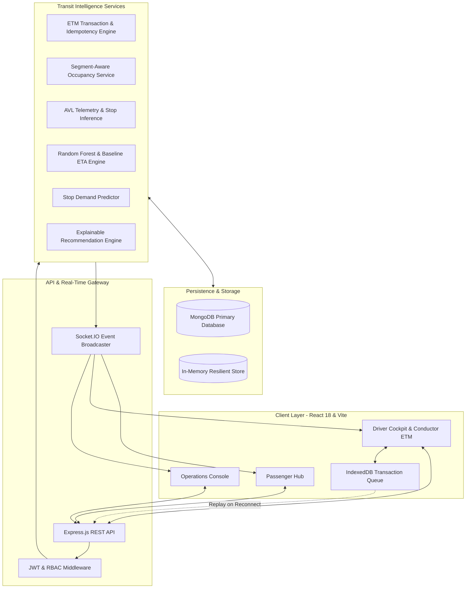
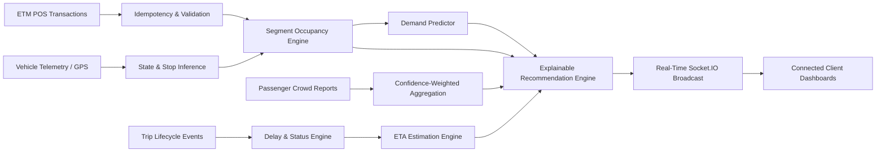

# TransitAI Mesh

> An event-driven transit intelligence platform that transforms conductor ticketing transactions, vehicle movement, and passenger observations into real-time operational state, occupancy estimation, and explainable commute recommendations.

[](https://nodejs.org/)
[](https://reactjs.org/)
[](https://expressjs.com/)
[](https://socket.io/)
[](https://www.mongodb.com/)
[](https://maplibre.org/)
[](https://tailwindcss.com/)

---

## Table of Contents

- [1. Executive Overview](#1-executive-overview)
- [2. The Problem](#2-the-problem)
- [3. The Core Idea](#3-the-core-idea)
- [4. System Architecture](#4-system-architecture)
- [5. The Intelligence Pipeline](#5-the-intelligence-pipeline)
  - [ETM and Transaction Integrity](#etm-and-transaction-integrity)
  - [Occupancy Estimation](#occupancy-estimation)
  - [ETA Estimation](#eta-estimation)
  - [Demand Estimation](#demand-estimation)
  - [Explainable Recommendations](#explainable-recommendations)
- [6. Real-Time Experience](#6-real-time-experience)
- [7. Geospatial Experience](#7-geospatial-experience)
- [8. Product Interfaces](#8-product-interfaces)
- [9. Engineering Decisions](#9-engineering-decisions)
- [10. Technology Stack](#10-technology-stack)
- [11. Running TransitAI Mesh Locally](#11-running-transitai-mesh-locally)
- [12. Demo Experience](#12-demo-experience)
- [13. Verification](#13-verification)
- [14. Current Scope and Future Integration](#14-current-scope-and-future-integration)
- [15. Closing](#15-closing)

---

## 1. Executive Overview

Urban transit is not simply a vehicle-location problem. For commuters standing at a station, knowing that a bus is two kilometers away does not answer the critical questions: *Will there be room to board? Is traffic compounding a delay? Would waiting for an express service arriving four minutes later offer a better commute?*

For municipal operators, raw GPS coordinates do not reveal passenger bottlenecks, station crowding, or segment-level demand across a corridor.

**TransitAI Mesh** explores how operational signals already present in public transit workflows—conductor Electronic Ticketing Machine (ETM) transactions, route stop progression, simulated vehicle location telemetry, and passenger crowd observations—can be synthesized into an authoritative, real-time intelligence layer.

---

## 2. The Problem

Public transit systems often suffer from fragmented, disconnected data streams that fail both riders and dispatchers:

* **Arrival Uncertainty**: Static timetables fail under dynamic urban traffic, while distance-only estimations ignore corridor bottlenecks and dwell times.
* **Occupancy Invisibility**: Passengers cannot see onboard crowding before a vehicle arrives, resulting in uneven passenger distribution across consecutive buses.
* **Service Disruption Gaps**: Delays accumulate silently along a line without automatic downstream ETA recalibration or passenger notification.
* **Fragmented Operational Truth**: Driver smartphones are ill-suited as primary data entry terminals during active driving, while passive passenger crowdsourcing is noisy and intermittent.
* **Limited Decision Support**: Commuters are presented with raw timetables rather than structured, explainable recommendations that balance arrival time against onboard comfort.

---

## 3. The Core Idea

The architectural thesis of TransitAI Mesh is built on a clear separation of operational signals:

1. **The Conductor's Electronic Ticketing Machine (ETM) is the primary operational source of truth.** Ticket sales explicitly record boarding stations, destination stations, passenger quantities, and timestamps.
2. **Vehicle telemetry provides movement context.** GPS coordinates and station-snapping logic anchor vehicles along physical route geometries.
3. **Passenger crowd reports are supplemental observations.** Rider submissions provide qualitative validation but are not permitted to override ETM transaction accounting.
4. **Intelligence must be explainable and fault-tolerant.** When historical data is sparse, the system relies on deterministic mathematical baselines rather than uncalibrated black-box models.

---

## 4. System Architecture

TransitAI Mesh is structured as a modular full-stack application with real-time WebSocket broadcasting and dual-layer persistence.



### Architectural Boundaries

* **Decoupled Ingestion**: HTTP REST endpoints handle transactional commands (`/api/ticketing/events`, `/api/trips/start`), which subsequently trigger WebSocket broadcasts.
* **Dual-Mode Persistence**: The backend automatically connects to MongoDB when available, and gracefully falls back to an embedded in-memory data store (`inMemoryStore.js`) to guarantee uninterrupted operational availability during local testing or demo reviews.
* **Role-Based Authorization**: Endpoints are strictly guarded by JSON Web Token (JWT) verification and role checks (`PASSENGER`, `DRIVER`, `ADMIN`).

---

## 5. The Intelligence Pipeline

The intelligence pipeline continuously processes operational events to derive vehicle state, crowding, and travel guidance.



---

### ETM and Transaction Integrity

The Electronic Ticketing Machine workflow represents physical passenger transactions issued by transit conductors:

* **Origin and Destination Accounting**: Each ticket captures `sourceStopId` (the vehicle's current station sequence) and `destinationStopId` (a downstream station sequence).
* **Passenger Batches**: Supports counts from 1 to 10 passengers per transaction across standard fare categories (`ADULT`, `STUDENT`, `SENIOR`).
* **Idempotent Processing**: Clients generate a unique `transactionId` for every issuance. The server enforces uniqueness via a compound index on `TicketTransaction`. If network instability causes duplicate submissions, the server detects the existing record and responds with HTTP 200 without double-counting passengers.
* **Offline Dead-Zone Queue**: In connectivity dead-zones, tickets are stored in browser **IndexedDB** (`transitai_offline_etm_events`). When the `window.online` event fires, the queue replays pending transactions and purges them only upon verified server acknowledgment.

---

### Occupancy Estimation

Occupancy is calculated using station-sequence interval math rather than flat entry counters.

When a vehicle reaches Station $S_{\text{current}}$, the engine filters all transactions associated with the active trip:

$$\text{Active Onboard} = \sum_{\text{tickets}} \text{passengerCount} \quad \text{where} \quad \text{source.sequence} \le S_{\text{current}} < \text{destination.sequence}$$

$$\text{Occupancy Percentage} = \min\left(100, \left\lfloor \frac{\text{Active Onboard}}{\text{Vehicle Capacity}} \times 100 \right\rfloor\right)$$

#### Illustrative Example
* **Bus Capacity**: 40 seats.
* **Stop 1 (Central Station)**: Conductor issues 15 tickets to Stop 4, and 10 tickets to Stop 3.  
  * *Onboard at Stop 1*: $15 + 10 = 25$ passengers ($62\%$ — `MEDIUM`).
* **Stop 3 (City Hospital)**: The 10 passengers alight. Conductor issues 5 new tickets to Stop 5.  
  * *Onboard departing Stop 3*: $(25 - 10) + 5 = 20$ passengers ($50\%$ — `MEDIUM`).

*Multi-source fusion combines ETM data (primary weight) with recent crowd observation reports to assign confidence ratings.*

---

### ETA Estimation

TransitAI Mesh uses a two-tiered ETA estimation structure:

1. **Deterministic Baseline**:
   $$\text{ETA}_{\text{baseline}} = (\text{Remaining Segment Count} \times 4\text{ minutes}) + \text{Reported Delay Minutes}$$
2. **Machine Learning Model (Prototype)**:
   * Embedded pure-JavaScript **Random Forest Regressor** (40 decision trees, maximum depth 6, bootstrap sampling).
   * Feature vector: `[routeId, currentStopIndex, destinationStopIndex, remainingStops, haversineDistanceKm, hourOfDay, dayOfWeek, isPeakHour, delayMinutes, segmentProgress]`.
   * **Safe Fallback**: If fewer than 10 historical trip records exist, the API automatically falls back to the deterministic baseline, ensuring reliable predictions regardless of training set size.

---

### Demand Estimation

While occupancy measures current onboard passengers, the demand engine estimates upcoming station load:
* Evaluates boarding density at downstream stations based on time-of-day multipliers (morning and evening commuter peaks).
* Projects expected alightings based on destination distribution from historical ticket transactions, giving operators foresight into upcoming station crowding.

---

### Explainable Recommendations

The recommendation engine ranks available corridor buses for a passenger's selected destination using a transparent scoring function:

$$\text{Score} = (\text{ETA Segments} \times 4) + \text{Crowd Penalty} + (\text{Delay Minutes} \times 2) - (\text{Available Seats} \times 0.15)$$

* **Crowd Penalties**: `LOW` = 0, `MEDIUM` = 5, `HIGH` = 12, `FULL` = 25.
* **Decision Output**: Lower scores represent superior travel options. The highest-ranked bus is flagged with human-readable rationale (e.g., *"Best Option: Low crowd and arriving soonest"*).

---

## 6. Real-Time Experience

TransitAI Mesh uses Socket.IO to maintain synchronized client state across all active roles without requiring manual page reloads.

| Socket Event | Triggering Action | Payload Content | Client Impact |
| :--- | :--- | :--- | :--- |
| `trip:started` | Driver begins route trip | `{ tripId, busId }` | Updates fleet active counters and line allocation meters |
| `bus:stopReached` | Bus advances to next station | `{ tripId, busId, currentStop, delayMinutes }` | Recalibrates passenger ETAs and moves map markers |
| `bus:delayUpdated` | Driver reports traffic delay | `{ tripId, busId, delayMinutes, reason }` | Broadcasts delay badges to passenger radar and admin log |
| `ticketing:occupancyUpdated` | Conductor issues ETM ticket | `{ busId, tripId, occupancy, ticket }` | Updates live seat meters and crowd indicators |
| `crowd:updated` | Passenger submits crowd report | `{ busId, routeId, estimate }` | Updates route crowd confidence indicators |
| `bus:location` | Telemetry engine position tick | `{ busId, routeId, location, movementStatus }` | Smoothly updates map marker coordinates |
| `trip:ended` | Driver completes terminal stop | `{ tripId, busId }` | Marks bus idle and removes active trip indicators |

---

## 7. Geospatial Experience

The mapping interface visualizes corridor structures and vehicle telemetry in geographic context:

* **Rendering Engine**: Built with **MapLibre GL JS** using standard vector/raster map layers.
* **Basemap Configuration**: Uses the public **CARTO Positron** basemap style (`https://basemaps.cartocdn.com/gl/positron-gl-style/style.json`), configured through `VITE_MAP_STYLE_URL` with an OpenStreetMap raster fallback.
* **Route Polylines**: Renders GeoJSON line geometries representing physical road paths between stations.
* **Vehicle Markers**: Displays live bus markers with heading indicators and crowd-level color coding (Emerald for low crowding, Amber for medium, Rose for high/full).
* **Telemetry Context**: Telemetry coordinates are currently generated by an internal Automatic Vehicle Location (AVL) simulation engine that advances along seeded coordinates. The map cleanly separates geographic rendering from telemetry ingestion.

---

## 8. Product Interfaces

### Passenger Hub (`/passenger`)
* **Corridor Radar**: Filter and inspect active bus lines across the municipal network.
* **Geospatial Map**: Live vehicle tracking with station popup cards showing ETAs and seat counts.
* **Commute Decision Card**: Evaluates active buses and presents the optimal ride recommendation based on arrival time, seating comfort, and delay risk.
* **Crowd Contribution Modal**: Allows commuters to submit real-time crowd reports with a 60-second cooldown rate limit.

### Driver Cockpit & Conductor ETM (`/driver`)
* **Trip Controls**: One-click actions to initiate scheduled trips, advance station sequences, and complete routes.
* **Conductor POS Terminal**: Mobile-responsive interface for selecting destination stops, ticket types, and passenger counts.
* **Dead-Zone Indicator**: Real-time indicator displaying network status and queued offline ticket counts.
* **Traffic Delay Broadcaster**: Interface for reporting traffic congestion, road works, or mechanical delays directly to dispatch.

### Operations Console (`/admin`)
* **Fleet KPI Meters**: Citywide metrics tracking active fleet count, in-progress trips, delayed services, and passenger reports.
* **Active Delay Incident Registry**: Central log detailing delayed vehicles, route identifiers, delay durations, and reported causes.
* **Corridor Allocation Grid**: Breakdown of vehicle distribution and station counts across all configured lines.

---

## 9. Engineering Decisions

* **ETM as Operational Ground Truth**: Rather than relying on unreliable passenger check-ins or distracting driver phone inputs, the system anchors passenger volume to physical conductor ticketing events.
* **Segment-Aware Interval Math**: Avoiding naive global headcounts ensures that passenger boarding and alighting along multi-stop corridors accurately reflects real-time seat availability.
* **Idempotent POS Ingestion**: Enforcing client-generated transaction IDs and unique database constraints protects the system from double-counting passengers during network retry storms.
* **Offline-First Storage Queue**: Using IndexedDB on the client guarantees that conductors can continue issuing tickets during network dead-zones with automatic reconciliation upon reconnection.
* **Deterministic Intelligence Fallbacks**: Machine learning models gracefully fall back to explainable deterministic heuristics when sample sizes are small, preventing ungrounded predictions.
* **Dual-Layer Persistence**: Mirroring database document queries in an embedded in-memory fallback store ensures that demonstration environments remain fully operational regardless of external database connectivity.

---

## 10. Technology Stack

| Layer | Technology | Purpose |
| :--- | :--- | :--- |
| **Frontend Framework** | React 18.3 | Component architecture and state management |
| **Build Tool** | Vite 5.4 | Bundling, hot module reloading, and build pipeline |
| **Styling** | Tailwind CSS 3.4 | Responsive, accessible utility styling |
| **Geospatial Rendering** | MapLibre GL JS 3.6 | Vector and raster geographic map visualization |
| **Icons** | Lucide React 0.439 | Interface iconography |
| **Backend Runtime** | Node.js 20+ (ESM) | Server-side JavaScript runtime |
| **API Framework** | Express.js 4.19 | RESTful routing and middleware pipeline |
| **Real-Time Layer** | Socket.IO 4.7 | Bi-directional WebSocket telemetry broadcast |
| **Database** | MongoDB 6+ / Mongoose 8.5 | Document storage and schema validation |
| **In-Memory Store** | Custom JavaScript Engine | Zero-downtime persistence fallback |
| **Authentication** | JWT (`jsonwebtoken` 9.0) & `bcryptjs` 2.4 | Token issuance and password hashing |
| **Offline Storage** | Browser IndexedDB | Client-side transactional event queuing |
| **Test Runner** | Node.js Built-in Test Runner (`node --test`) | Unit and integration test execution |

---

## 11. Running TransitAI Mesh Locally

### Prerequisites
* **Node.js**: Version 20.0.0 or higher
* **npm**: Version 9.0.0 or higher
* **MongoDB** *(Optional)*: Local or cloud instance (the backend will automatically operate in in-memory mode if MongoDB is absent)

### Installation & Setup

1. **Clone the repository**:
   ```bash
   git clone https://github.com/your-username/transitai-mesh.git
   cd transitai-mesh
   ```

2. **Install all dependencies**:
   ```bash
   npm run install:all
   ```

3. **Configure environment variables**:
   ```bash
   # Backend configuration
   cp server/.env.example server/.env

   # Frontend configuration
   cp client/.env.example client/.env
   ```

   *Default `server/.env`:*
   ```env
   PORT=5000
   MONGODB_URI=mongodb://127.0.0.1:27017/transitai_mesh
   JWT_SECRET=transitai_studio_jwt_secret_dev_key_2024
   CLIENT_URL=http://localhost:5173
   GPS_SIMULATOR_ENABLED=true
   NODE_ENV=development
   ```

   *Default `client/.env`:*
   ```env
   VITE_API_URL=http://localhost:5000/api
   VITE_SOCKET_URL=http://localhost:5000
   VITE_MAP_STYLE_URL=https://basemaps.cartocdn.com/gl/positron-gl-style/style.json
   ```

4. **Seed database** *(Optional when using MongoDB)*:
   ```bash
   npm run seed
   ```

5. **Start development servers**:
   ```bash
   # Terminal 1: Backend Server
   npm run dev:server

   # Terminal 2: Frontend Client
   npm run dev:client
   ```

6. **Access application**:
   * Frontend: `http://localhost:5173` (or port assigned by Vite)
   * Backend API Health: `http://localhost:5000/health`

---

## 12. Demo Experience

For local evaluation and demonstration, the database includes seeded accounts across all three platform roles:

* **Demo Password for all accounts**: `Transit123!`

| Role | Email | Demonstrated Capabilities |
| :--- | :--- | :--- |
| **Passenger** | `passenger@transitai.local` | Corridor routing, live map tracking, arrival recommendations, crowd voting |
| **Driver / Conductor** | `driver@transitai.local` | Trip progression, station advancement, ETM ticket issuing, offline dead-zone sync |
| **Operations Admin** | `admin@transitai.local` | Citywide fleet KPIs, delay incident tracking, line capacity allocation |

*Note: The frontend navigation includes a persistent role-switcher widget in development mode to facilitate seamless evaluation across roles.*

---

## 13. Verification

The codebase includes automated test suites executed via the native Node.js test runner:

```bash
# Execute unit test suite
npm run test:unit
```

### Verified Test Results
* **Unit Tests**: **23 passing / 0 failing**
  * Authentication middleware & role guards
  * Crowd penalty calculations & recency decays
  * Deterministic ETA segment calculations
  * Random Forest regressor training & inference bounds
  * IndexedDB offline queue deduplication & sync
  * Recommendation scoring formulas
  * Socket controller lifecycle management
  * Haversine stop snapping & route progress inference
* **Frontend Build**: Verified production compilation via `npm run build` with zero syntax or bundling errors.

---

## 14. Current Scope and Future Integration

TransitAI Mesh is an **evaluation-backed engineering prototype** designed to demonstrate transit intelligence architectures. To maintain strict technical accuracy, the current prototype boundaries and potential production pathways are outlined below:

### Current Prototype Boundaries
* **Simulated Telemetry**: Vehicle positions are generated by an internal Automatic Vehicle Location (AVL) simulation engine advancing along route geometry rather than live municipal GPS hardware feeds.
* **Web-Based ETM POS**: The conductor terminal is implemented as a mobile-responsive web interface rather than dedicated ESC/POS thermal printer hardware.
* **Corridor Scope**: Pre-seeded with 6 municipal transit corridors representing the Mysuru urban transit network.
* **Occupancy Model**: Derived mathematically from active ticket transaction intervals and crowd observations; cannot detect fare evasion without physical doorway sensor integration.

### Potential Future Integration Pathways
* **GTFS / GTFS-RT Ingestion**: Integration with standard General Transit Feed Specification Realtime protobuf streams from transport authorities.
* **Physical POS SDKs**: Native Android POS terminal integration with thermal receipt printing and smartcard (NFC/RuPay) support.
* **Dynamic Stage-Based Fare Matrices**: Expanding flat ticket categories to multi-tier geofenced distance fare calculations.
* **Expanded Historical ML Training**: Training larger gradient-boosted regression models on multi-month municipal historical trip records.

---

## 15. Closing

Transit predictability is not achieved by more frequent GPS pings alone. It is achieved by grounding intelligence in the actual operational events that govern transit systems. 

By treating the conductor's ticketing machine as the authoritative source of passenger movement, pairing movement context with idempotent transaction guarantees, and structuring decisions around transparent heuristics, **TransitAI Mesh demonstrates a resilient, operationally grounded model for urban transit intelligence.**
